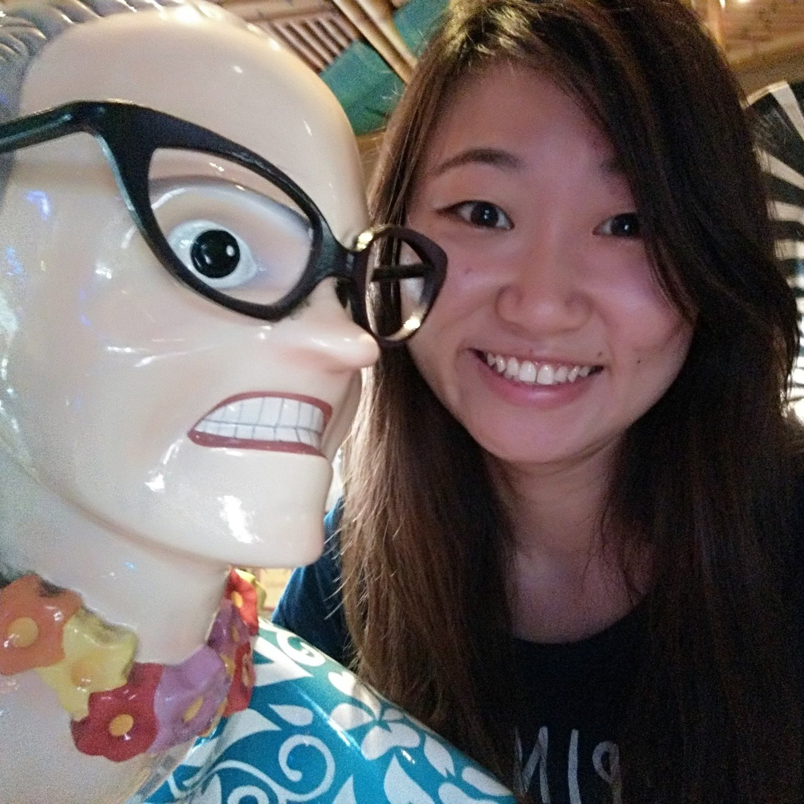
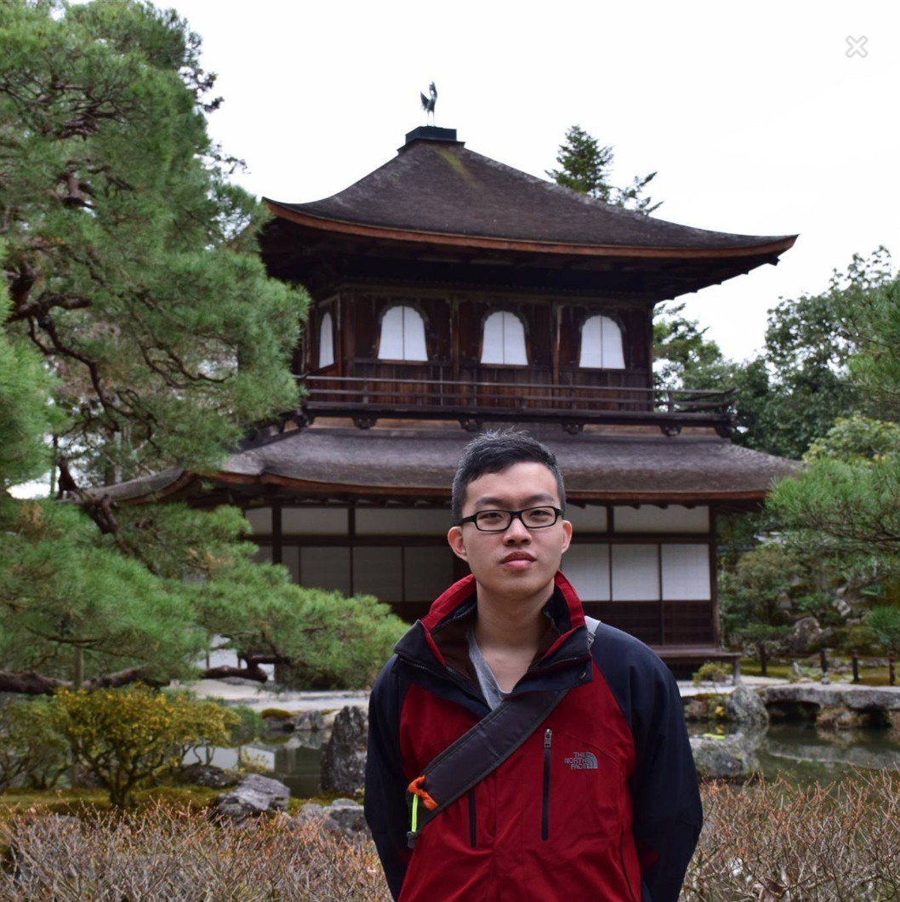
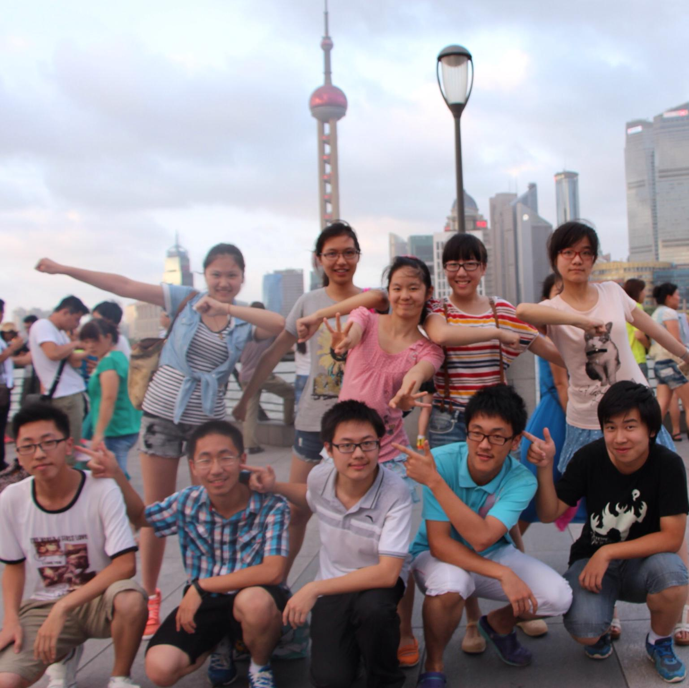

<!--- @@author A0113992B-reused --->
# About Us

We are a team based in the [School of Computing, National University of Singapore](http://www.comp.nus.edu.sg).

## Project Team

<!--- @@author A0113992B --->
#### [Akshay Narayan](http://www.comp.nus.edu.sg/~anarayan/)  
 
**Role**: Project Advisor

-----

#### [Gao Yu](https://github.com/GaoYu-Karen)
 
**Role**: Developer    
**Responsibilities**: 
1. All UI components of SuperbTodo
	*Style sheet
	*Clock function 
	*Help, minimize, maximize, close buttons
	*Task entry 
2. Testing
3. Documentation
	*About us
	*Contact us
	*User guide: features
	*Developer guide: user stories and product survey

-----

#### [Ong Qi Yong](https://github.com/oqyxxy) 
 
**Role**: Developer    
**Responsibilities**: 
1. Most of Logic components of SuperbTodo
	*Parser
	*Add, clear, remove, edit, list commands
2. Testing
3. Documentation
	*User guide: features
	*Developer guide: use cases and non functional requirements
	*All diagrams and pictures used
	
-----

#### [Yu Xiaodong](https://github.com/yxd117)
 
**Role**: Developer    
**Responsibilities**: 
1. All Storage components of SuperbTodo
2. Undone and done commands
3. Testing

-----

<!--- @@author A0113992B-reused --->
# Contributors

We welcome contributions. See [Contact Us](ContactUs.md) page for more info.

* [Akshay Narayan](https://github.com/se-edu/addressbook-level4/pulls?q=is%3Apr+author%3Aokkhoy)
* [Sam Yong](https://github.com/se-edu/addressbook-level4/pulls?q=is%3Apr+author%3Amauris)